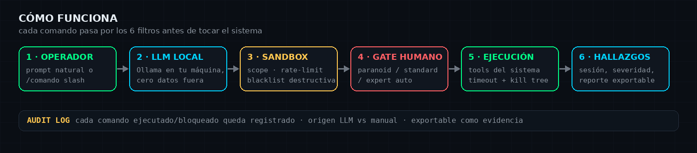
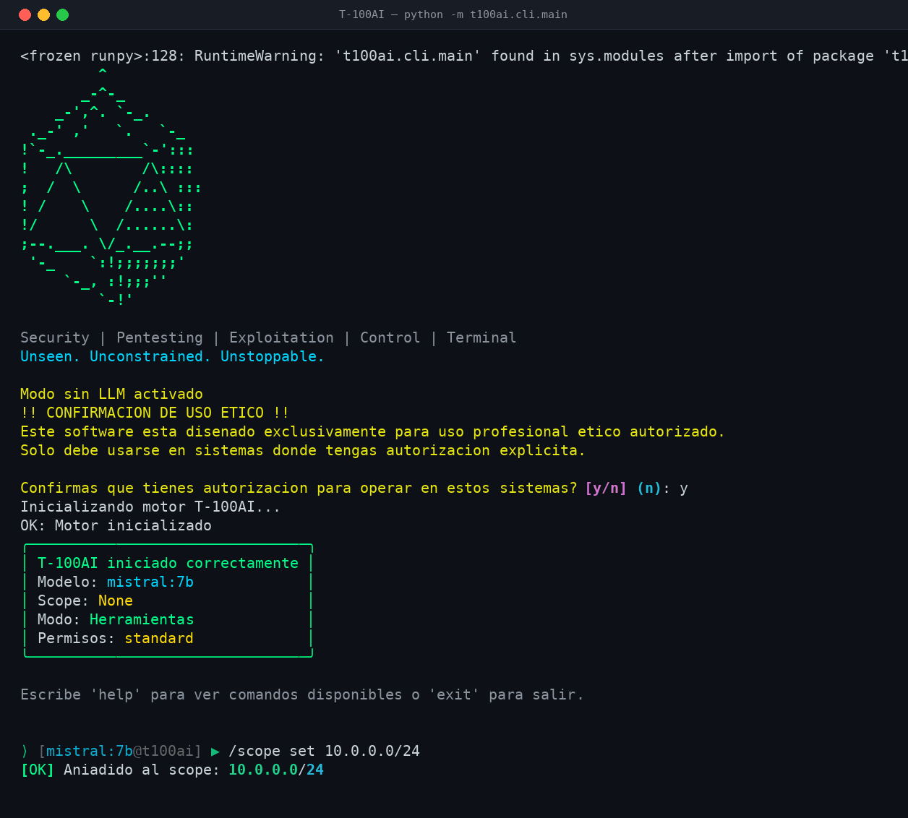
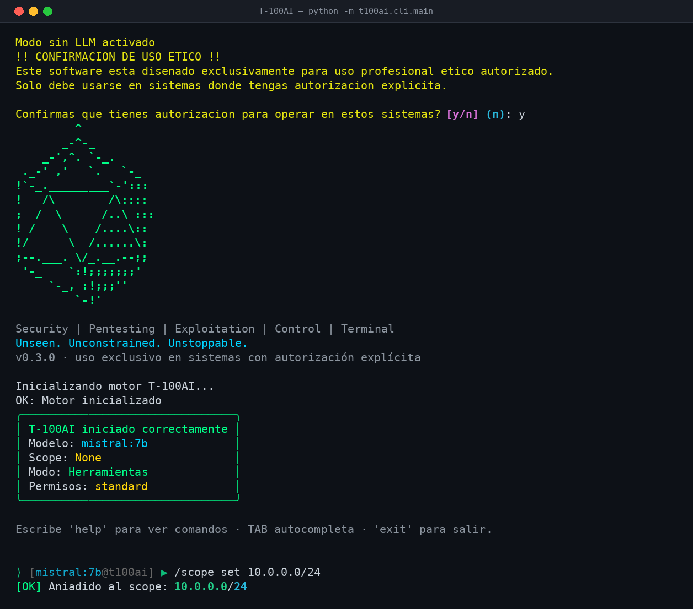
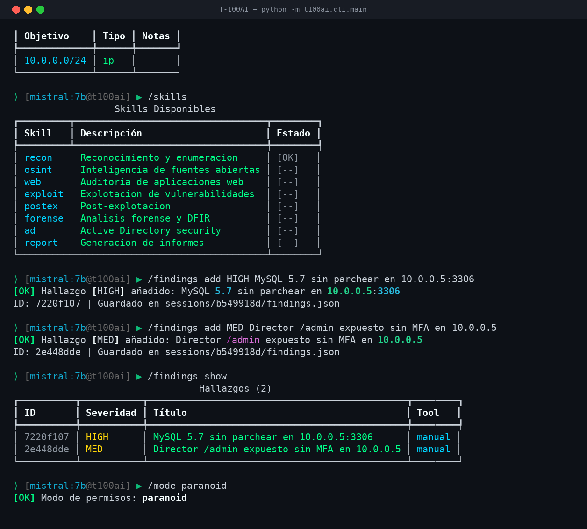
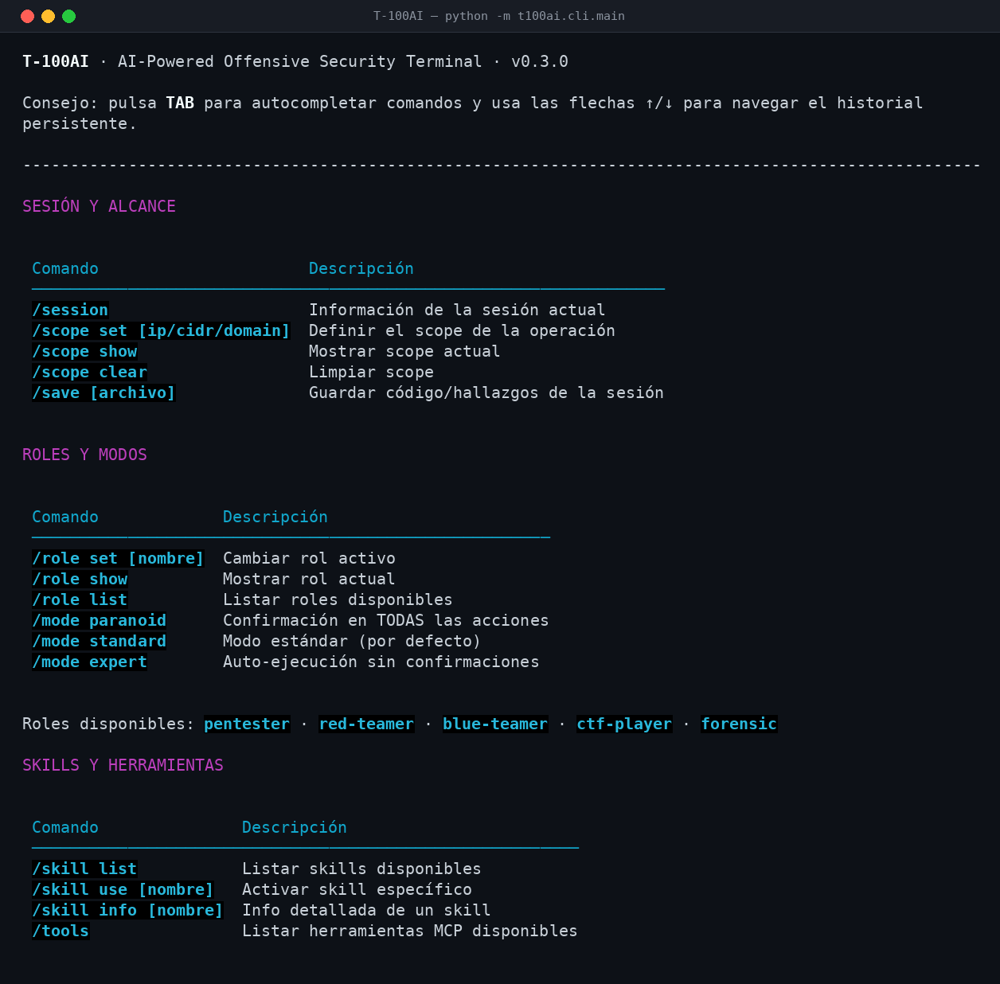
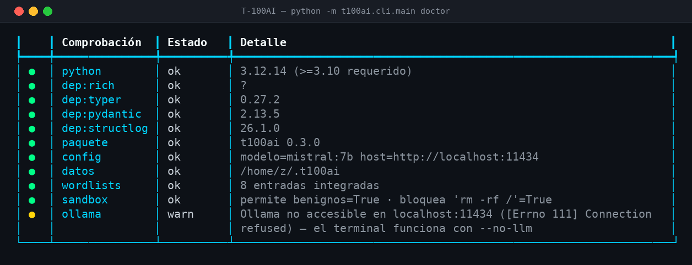
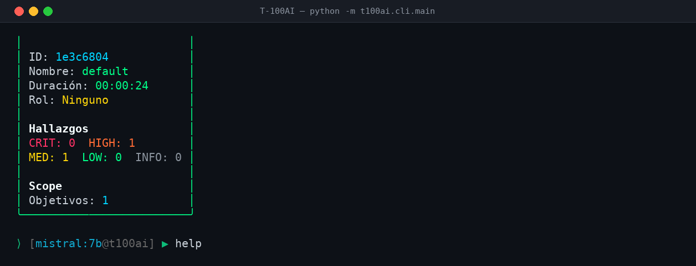
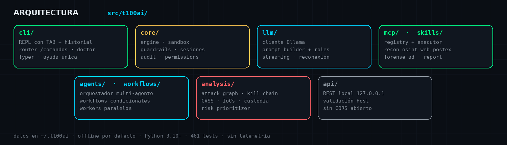

<div align="center">


[](https://github.com/Ruby570bocadito/T-100AI/actions/workflows/ci.yml)


**Terminal de operaciones ofensivas asistido por un LLM 100% local (Ollama).**
Nada sale de tu máquina: sin telemetría, sin APIs en la nube, sin fugas.
El modelo propone, un sandbox valida y **tú confirmas** cada comando antes de ejecutarlo.

`pentesting autorizado` · `laboratorios` · `CTF` — cada acción pasa por un gate de confirmación ética y por el sandbox.

[Instalación](#instalación) · [Uso](#uso) · [En acción](#en-acción) · [Arquitectura](#arquitectura) · [Changelog](CHANGELOG.md)

</div>

---

## Cómo funciona



1. **Propón** — escribes lenguaje natural (`escanea los puertos de 10.0.0.5`) o comandos slash (`/scope set 10.0.0.0/24`).
2. **Decide el modelo** — el LLM local responde y puede proponer comandos con `<cmd>…</cmd>`.
3. **Valida el sandbox** — scope autorizado, rate-limit, límite por sesión y blacklist de comandos destructivos (`rm -rf /`, `dd of=/dev/sd`, fork bombs…).
4. **Confirma el humano** — modo `paranoid` pide confirmación para todo; `standard` en cada comando; `expert` auto-ejecuta.
5. **Registra todo** — hallazgos, decisiones y comandos quedan en la sesión y exportables a reporte.

## Características

| | |
|---|---|
| **LLM local (Ollama)** | mistral, llama3, qwen, gemma, deepseek… cero datos fuera de la máquina |
| **Sandbox con filtros** | scope, rate-limit, límite de sesión, blacklist destructiva, kill del árbol de procesos en timeout |
| **Skills integrados** | recon, osint, web, exploit, postex, forense, active directory, reporting |
| **MCP avanzado** | registro de herramientas, chains, parsers de output, plantillas |
| **Multi-agente** | orquestador con workers paralelos: Recon → Exploit → Analyst → Reporter |
| **Workflows** | condicionales, con variables y editor interactivo; `osint_full`, `full_pentest`, `web_audit`… |
| **Guardrails** | detección de prompt injection, filtrado de datos sensibles, audit log |
| **Plugins** | loader propio + marketplace local |
| **Modo sin LLM** | `--no-llm`: skills y herramientas sin modelo, útil en CI/air-gap |

## Instalación

**Requisitos:** Python 3.10+ y [Ollama](https://ollama.ai) corriendo en local.

```bash
git clone https://github.com/Ruby570bocadito/T-100AI.git
cd T-100AI
pip install -r requirements.txt        # 1) dependencias
pip install -e .                       # 2) registra el paquete t100ai (comando `t100ai`)
ollama pull mistral:7b                 # 3) modelo por defecto
```

> **Windows:** también puedes arrancar directamente con `run.bat` — añade `src/` al
> `PYTHONPATH` por ti, así `python -m t100ai.cli.main` funciona aunque no hayas hecho
> el paso 2. En Linux/macOS: `./run.sh`. Docker: `docker compose up`.

## Uso

```bash
python -m t100ai.cli.main              # terminal interactivo
python -m t100ai.cli.main -s 10.0.0.5  # con scope inicial
python -m t100ai.cli.main --no-llm     # sin modelo (solo skills/tools)
t100ai version && t100ai info          # entry point del paquete
t100ai doctor                          # diagnóstico del entorno
t100ai session list                    # sesiones guardadas (save/load/list/export)
```

En el REPL: **TAB** autocompleta comandos y subacciones, **↑/↓** navegan el
historial persistente (se guarda entre sesiones) y los comandos desconocidos
sugieren el más cercano (`/scop` → *¿Quisiste decir: /scope?*).

Al arrancar se pide **confirmación de uso ético**; después, REPL:

```
⟩ [mistral:7b@t100ai] ▶ /scope set 10.0.0.0/24
⟩ [mistral:7b@t100ai] ▶ escanea los puertos de 10.0.0.5
```

## En acción

Sesión completa — gate ético, scope, propuesta del modelo, validación del sandbox, confirmación humana, hallazgos con severidad y reporte:



| Arranque con gate ético | Skills, hallazgos y modos (`--no-llm`) |
|:---:|:---:|
|  |  |

<details>
<summary><b>Más capturas</b> — ayuda integrada, doctor y resumen de sesión</summary>
<br>

| `/help` (fuente única con el router) | `t100ai doctor` (deps, config, sandbox, Ollama) |
|:---:|:---:|
|  |  |

| Resumen de sesión `/session` |
|:---:|
|  |

</details>

### Comandos (todos operativos, verificados en el router)

| Grupo | Comandos |
|---|---|
| Sesión | `/session` · `/scope set\|show\|clear` · `/save` |
| Roles/modos | `/role set\|show\|list` · `/mode paranoid\|standard\|expert` |
| Skills/tools | `/skill list\|use\|info` · `/tools` |
| Modelo | `/model info\|switch\|list` |
| Hallazgos | `/findings show\|add\|score` |
| Reportes | `/report generate\|preview\|session\|export` · `/log show\|export` |
| Contexto | `/context show\|clear` · `/history` · `/perf` |
| Agentes | `/agent list\|spawn\|status` · `/deploy task\|status\|list` |
| Workflows | `/workflow list\|run\|status` · `/plugin list\|search\|install` |
| Utilidades | `/wordlist dir\|subdomain\|user\|pass\|sql\|xss\|lfi\|cve\|all` · `/read` · `/help` |

## Arquitectura



## Seguridad y ética

- **Sandbox blacklist-first**: solo bloquea lo destructivo e irreversible; el resto pasa por scope y confirmación humana. Ver `core/sandbox.py`.
- **Sin red externa obligatoria**: el LLM es local; los skills llaman a herramientas del sistema solo cuando existen.
- **API local por defecto** (`127.0.0.1`), valida cabecera `Host` y no abre CORS.
- **Audit log** de comandos ejecutados/bloqueados separado por origen (LLM vs manual).
- Úsalo **solo** en sistemas con autorización explícita. El gate de confirmación ética existe por algo.

## Tests y calidad

```bash
python -m pytest tests/ -q          # 461 tests offline
ruff check src/ tests/              # E/F/W/I sin excepciones
```

CI en GitHub Actions: lint + tests en Python 3.10/3.11/3.12.

## Changelog

Ver [CHANGELOG.md](CHANGELOG.md) — v0.3.1: lanzadores `run.bat`/`run.sh` arreglados (PYTHONPATH automático, adiós al `ModuleNotFoundError`), limpieza de código muerto y documentación renovada con banner, GIF y diagramas nuevos.

## Licencia

MIT — ver [LICENSE](LICENSE).
